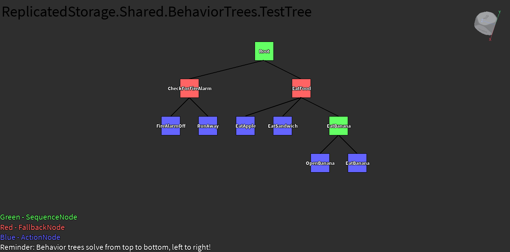

  

    
    
  

# RbxBehaviorTree

A simple behavior tree implementation for Roblox. The [plugin](https://github.com/Fangous/RbxBehaviorTree) is currently in development.

[View docs](https://fangous.github.io/RbxBehaviorTree/)

    

